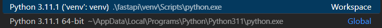

# python-api
### Python API Development - Comprehensive Course for Beginners
- https://youtu.be/0sOvCWFmrtA

Setting up your Virtual Env on Windows
- https://youtu.be/0sOvCWFmrtA?t=1475
- Run the below commands in bash then check the (venv) C:\... in CMD
```
cd {project dir}
py -3 -m venv {name}
venv/Scripts/activate.bat
```
- From View > Command Palette - check the '.\fastapi\venv\Scripts\python.exe' is selected as per below screenshot</br></br>
</br></br>
- https://fastapi.tiangolo.com/tutorial/
