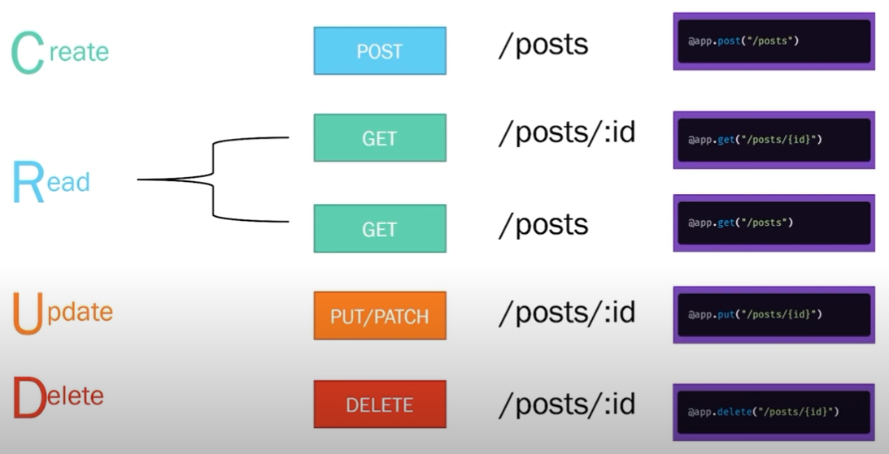

# python-api
### Python API Development - Comprehensive Course for Beginners
- https://youtu.be/0sOvCWFmrtA

Setting up your Virtual Env on Windows
- https://youtu.be/0sOvCWFmrtA?t=1475
- Run the below commands in bash then check the (venv) C:\... in CMD
```
cd {project dir}
py -3 -m venv {name}
```
- Run the below command in bash then check the (venv) $ in Bash
```
venv/Scripts/activate.bat
```
- Restart both CMD and Bash Terminals and you should see (venv) in front of each command prompt
- From View > Command Palette - check the '.\fastapi\venv\Scripts\python.exe' is selected as per below :</br></br>
</br></br>
- https://fastapi.tiangolo.com/tutorial/</br>
Install Fastapi with all the dependencies with the command below (in Bash):
```
pip install fastapi[all]
pip freeze # to list all the installed packages
```
To run your App (in Bash):
```
$ uvicorn main:app --reload
INFO:     Uvicorn running on http://127.0.0.1:8000 (Press CTRL+C to quit)
INFO:     Started reloader process [26976] using WatchFiles
INFO:     Started server process [15252]
INFO:     Waiting for application startup.
INFO:     Application startup complete.
WARNING:  WatchFiles detected changes in 'main.py'. Reloading...
INFO:     Started server process [18832]
INFO:     Waiting for application startup.
INFO:     Application startup complete.
INFO:     127.0.0.1:60060 - "GET / HTTP/1.1" 404 Not Found
INFO:     127.0.0.1:60060 - "GET /api HTTP/1.1" 200 OK
```
Then goto : http://127.0.0.1:8000 and you should receive in your browser :</br></br>
```
{"message":"Hello World"}


```
#### Links
- https://developer.mozilla.org/en-US/docs/Web/HTTP/Methods
- https://www.postman.com/downloads/
- https://docs.pydantic.dev/usage/types/
- https://developer.mozilla.org/en-US/docs/Web/HTTP/Status
</br></br>
#### CRUD (Create, Read, Update & Delete)

